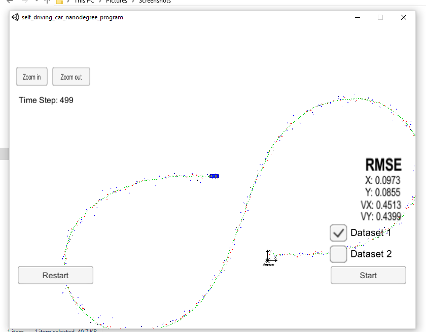
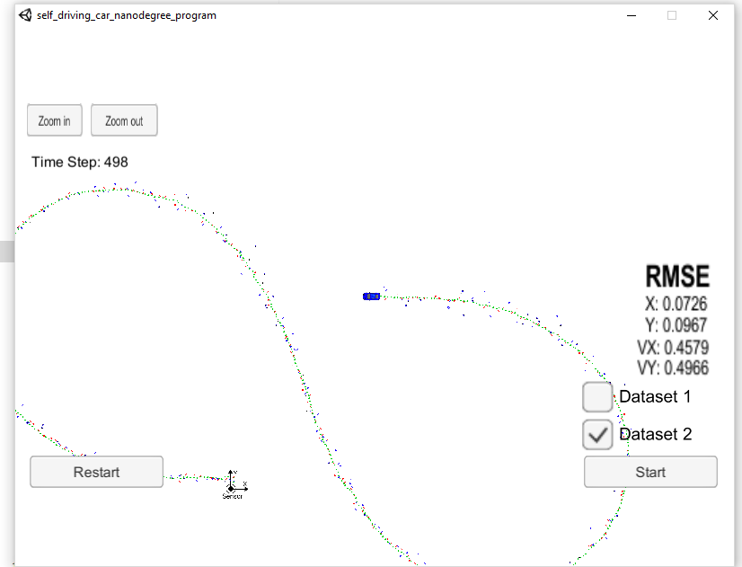

Extended Kalman Filter Project Starter Code

Self-Driving Car Engineer Nanodegree Program

In this project I utilize a kalman filter to estimate the state of a moving object of interest with noisy lidar and radar measurements. Passing the project requires obtaining RMSE values that are lower that the tolerance values [0.11, 0.11, 0.52, 0.52].
The final values are [0.0973, 0.0855, 0.4513, 0.4399].

And another set of values are [0.0726, 0.0967, 0.4579, 0.4966].

This project involves the Term 2 Simulator and installation of uWebSocketIO. The main program can be built and run by doing the following from the project top directory.

mkdir build
cd build
cmake .. && make
./ExtendedKF

Note that the main codes are src/FusionEKF.cpp, src/FusionEKF.h, kalman_filter.cpp, kalman_filter.h, tools.cpp, and tools.h

INPUT: values provided by the simulator to the c++ program

["sensor_measurement"] => the measurement that the simulator observed (either lidar or radar)

OUTPUT: values provided by the c++ program to the simulator

["estimate_x"] <= kalman filter estimated position x ["estimate_y"] <= kalman filter estimated position y ["rmse_x"] ["rmse_y"] ["rmse_vx"] ["rmse_vy"]
